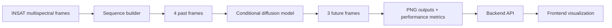
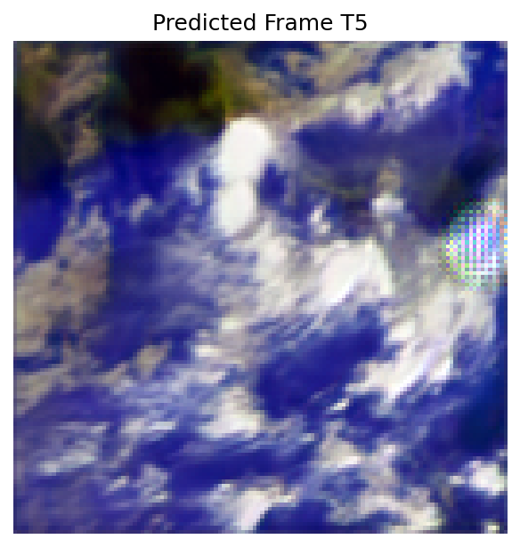
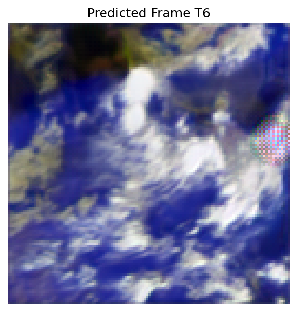
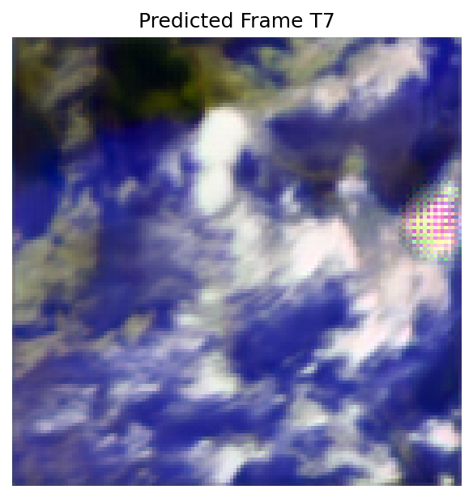
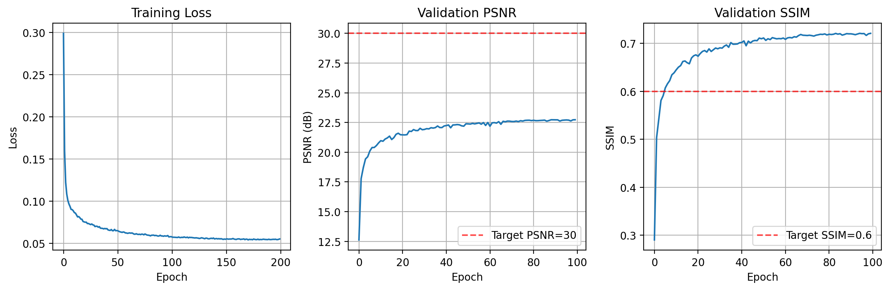
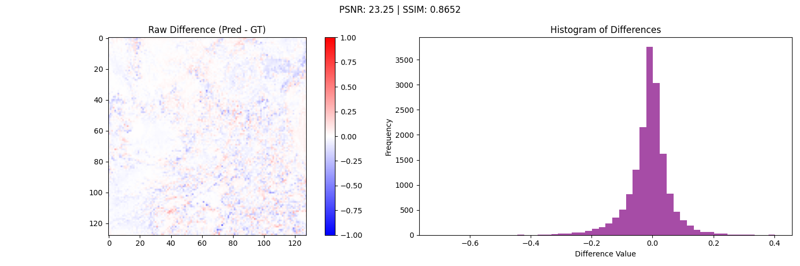

# K.A.L.A.M.

<div align="center">
  
  <h3>Knowledge-guided Atmospheric Learning for Adaptive Motion Forecasting</h3>
  <p>
    A research-oriented atmospheric nowcasting system for predicting short-term cloud motion
    from multispectral INSAT satellite imagery.
  </p>
  <p>
    <strong>Team DOMinators</strong> | ISRO Bharatiya Antariksh Hackathon (BAH) 2025 recognition
  </p>
</div>

---

## Overview

K.A.L.A.M. is an end-to-end prototype for short-horizon satellite nowcasting. It combines a
multispectral sequence-learning pipeline, diffusion-based future-frame prediction, quantitative
evaluation, and an interactive web interface for model inspection and visual analysis.

The repository contains:

- A Python research pipeline for sequence preparation, training, inference, and evaluation
- A Node.js backend for file upload, prediction metadata serving, and WebSocket log streaming
- A React frontend for exploratory analysis, sequence browsing, and prediction visualization

This codebase was prepared as both a hackathon system and a research prototype suitable for
further paper development, benchmarking, and reproducibility work.

---

## Abstract

Accurate short-term cloud motion forecasting is important for weather analysis, disaster
preparedness, and Earth observation operations. K.A.L.A.M. approaches this problem using
multispectral INSAT imagery and a conditional generative modeling pipeline that consumes four
historical frames and predicts the next three future frames. The current implementation combines
diffusion modeling, a graph-inspired bottleneck for spatial interaction, and quantitative
comparison through image-quality metrics such as PSNR, SSIM, and MSE. The project also provides
an operational interface for browsing predicted sequences, serving output imagery, and streaming
model logs in real time.

---

## Highlights

- Predicts `T+1`, `T+2`, and `T+3` future satellite frames from the previous 4 frames
- Works with multispectral channels such as `IMG_VIS`, `IMG_MIR`, `IMG_SWIR`, `IMG_TIR1`, `IMG_TIR2`, and `IMG_WV`
- Includes sequence preparation utilities from `.pt` tensors to `.npy` and `.png` assets
- Reports quantitative performance from `performance.json` and aggregate frame metrics
- Ships with a React dashboard for sequence playback, band inspection, and result review
- Streams backend Python execution logs over WebSocket for model testing workflows

---

## Method Snapshot

The main training file describes the model as:

- Conditional DDPM
- GCN-style bottleneck over latent spatial grids
- PiNN practicality loss
- SSL teacher loop
- Meta-learner correction

The current data interface in the training pipeline is:

```text
Input  : [B, 4, 6, H, W]
Target : [B, 3, 6, H, W]
```

Sequence flow:



---

## Visual Results

### Inference Outputs

<div align="center">
  
  
  
</div>

<p align="center">
  Representative future-frame predictions generated by the inference pipeline.
</p>

### Training and Evaluation Artifacts

<div align="center">
  
  
</div>

<p align="center">
  Included repository artifacts for training dynamics and prediction difference analysis.
</p>

---

## System Architecture

### Research Pipeline

- `Python-Backend/train5.py` contains the primary research model and training loop
- `Python-Backend/pt2np.py` converts `sequence_*.pt` tensors into `.npy` input and target arrays
- `Python-Backend/npy2png.py` converts saved arrays into `.png` visual assets
- `Python-Backend/view.py` visualizes `.pt` sequence tensors for inspection
- `Python-Backend/conv_2_onnx.py` exports a trained checkpoint to ONNX

### Backend

- `backend/app.js` exposes REST endpoints and serves predicted images statically
- `backend/controllers/modelTest.controller.js` resolves predicted sequence folders and metrics
- `backend/controllers/r2upload.controller.js` handles upload and metadata persistence
- `backend/utils/websocket.js` supports real-time Python log streaming

### Frontend

- `frontend/src/pages/SatelliteAnimationPage.jsx` drives the prediction visualization flow
- `frontend/src/pages/ReportPage.jsx` handles uploads and report interactions
- `frontend/src/components/ModelTestAndTerminalPreview.jsx` surfaces streamed execution logs

---

## Repository Layout

```text
.
|-- Python-Backend/
|   |-- train5.py
|   |-- pt2np.py
|   |-- npy2png.py
|   |-- conv_2_onnx.py
|   |-- inference_outputs/
|   `-- outputs/
|-- backend/
|   |-- app.js
|   |-- controllers/
|   |-- routes/
|   |-- config/
|   |-- models/
|   `-- utils/
`-- frontend/
    |-- public/
    `-- src/
```

---

## Getting Started

### 1. Clone

```bash
git clone https://github.com/info-gallary/K.A.L.A.M..git
cd K.A.L.A.M.
```

### 2. Backend Setup

```bash
cd backend
npm install
```

Create `backend/.env` with the required runtime settings:

```env
PORT=3000
NODE_ENV=development
MONGO_URL=mongodb://localhost:27017/project-kalam
R2_ENDPOINT=your_r2_endpoint
R2_ACCESS_KEY_ID=your_r2_access_key
R2_SECRET_ACCESS_KEY=your_r2_secret
R2_BUCKET_NAME=your_bucket
R2_PUBLIC_URL=your_public_base_url
```

Run the backend:

```bash
npm run dev
```

### 3. Frontend Setup

```bash
cd ../frontend
npm install
npm run dev
```

Open:

- Frontend: `http://localhost:5173`
- Backend: `http://localhost:3000`
- WebSocket: `ws://localhost:3001`

---

## Important Local Path Configuration

Some paths are currently hardcoded for a local Windows development environment and should be
updated before wider release or reproducible deployment.

- `backend/app.js`
  - `testOutputPath = "D:\\Hackathon\\ISRO\\pre_final\\inference_outputs\\test"`
- `backend/controllers/modelTest.controller.js`
  - `pythonScriptPath = "d:\\Hackathon\\ISRO\\pre_final\\test1.py"`
  - `testOutputPath = "D:\\Hackathon\\ISRO\\pre_final\\inference_outputs\\test"`

These values should be moved to environment variables in a publication or production release.

---

## API Surface

### Core

- `GET /`
- `GET /api/prediction-images/*`

### Upload and Storage

- `POST /api/v1/upload`
- `POST /api/v1/test-upload`
- `GET /api/v1/health`

### Model Test and Prediction

- `POST /api/v1/folder-path`
- `POST /api/v1/predict-frames`
- `GET /api/v1/available-sequences`

---

## Data and Prediction Flow

```text
sequence_*.pt
  -> pt2np.py
  -> input_*.npy / target_*.npy
  -> npy2png.py
  -> PNG artifacts
  -> inference output folders
  -> backend sequence serving
  -> frontend analysis and playback
```

For predicted sequences, the backend expects folders named like:

```text
sequence_0000/
sequence_0001/
sequence_0002/
```

and predicted files named like:

```text
predicted_t5_IMG_VIS.png
predicted_t6_IMG_MIR.png
predicted_t7_IMG_WV.png
```

along with a `performance.json` file per sequence folder.

---

## Research Positioning

K.A.L.A.M. is structured to support:

- Paper drafting around multispectral cloud motion forecasting
- Experimental comparison of future-frame prediction quality
- Ablation work over channels, sequence length, and diffusion settings
- Export and deployment experiments through ONNX
- Demonstration-ready interfaces for review panels, judges, and collaborators

Potential next research steps:

- Replacing hardcoded paths with a reproducible config system
- Adding experiment tracking and deterministic config snapshots
- Publishing dataset preparation details and exact evaluation splits
- Including benchmark baselines and statistical comparison tables
- Packaging inference into a single reproducible CLI

---

## Recognition

This repository documents the K.A.L.A.M. system developed by Team DOMinators for
the ISRO Bharatiya Antariksh Hackathon (BAH) 2025.

The existing project notes describe the work as an award-recognized BAH 2025 submission.
If this repository is being used for formal publication, update the final accolade line to
match the exact official wording used on certificates, announcements, or institutional records.

---

## Citation

If you use or extend this work in a paper, report, or demo, cite the repository and team
appropriately. A draft BibTeX entry can be adapted as:

```bibtex
@misc{kalam2025,
  title        = {K.A.L.A.M.: Knowledge-guided Atmospheric Learning for Adaptive Motion Forecasting},
  author       = {Team DOMinators},
  year         = {2025},
  howpublished = {\url{https://github.com/info-gallary/K.A.L.A.M..git}},
  note         = {Research prototype for multispectral cloud motion nowcasting}
}
```

---

## Acknowledgements

- Indian Space Research Organisation (ISRO)
- Bharatiya Antariksh Hackathon (BAH) 2025
- Team DOMinators
- Open-source communities powering PyTorch, React, Express, MongoDB, and Cloudflare R2

---

## License

This project is licensed under the MIT License. See [LICENSE](LICENSE).
